# CrossFit Gym Website

A modern, dynamic website for a CrossFit Gym built with Laravel. This project showcases various pages essential for a fitness center, including class schedules, trainer profiles, blog posts, and more.

## Table of Contents

- [Features](#features)
- [Screenshots](#screenshots)
- [Installation](#installation)
- [Tech Stack](#tech-stack)

## Features

- **Home Page**: Landing page with an overview of the gym.
- **About Us**: Information about the gym's history and mission.
- **Classes**: Details about the different fitness classes offered.
- **Schedule**: Weekly timetable of classes.
- **Trainers**: Profiles of the gym's professional trainers.
- **Blog**: A section for fitness articles and news.
- **Contact**: Contact form and location details.
- **FAQ**: Frequently asked questions.
- **Legal**: Privacy Policy and Terms of Service pages.

## Screenshots

### Home Page

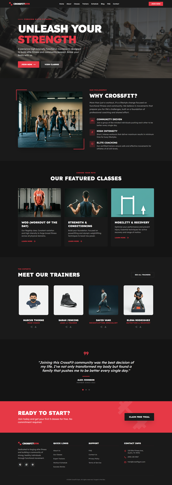

### About Us

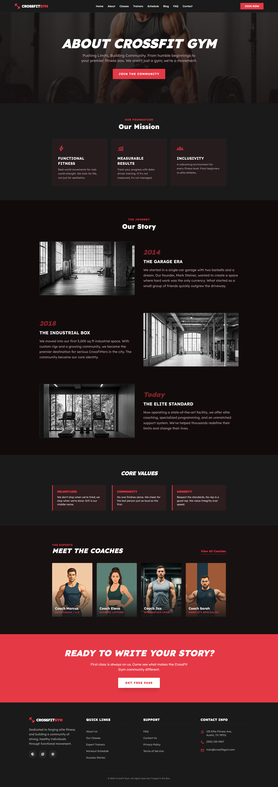

### Classes

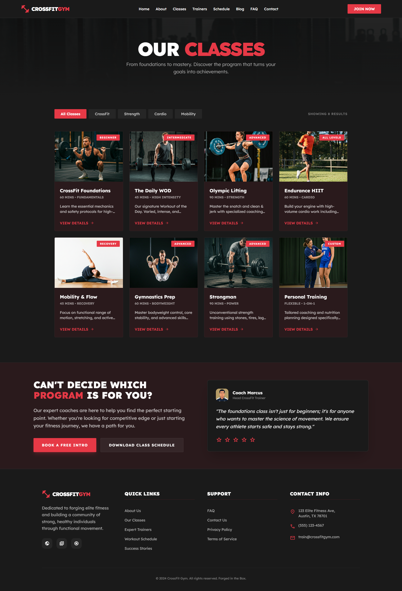

### Class Schedule

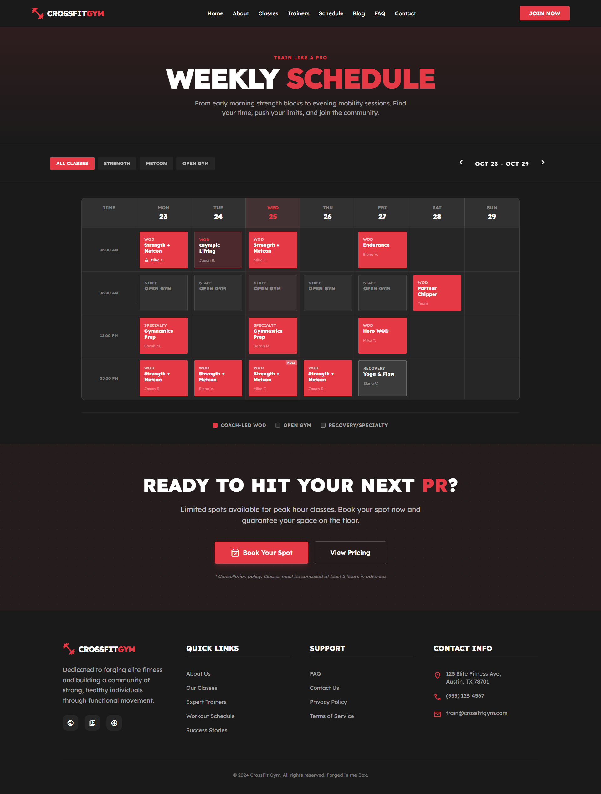

### Trainers

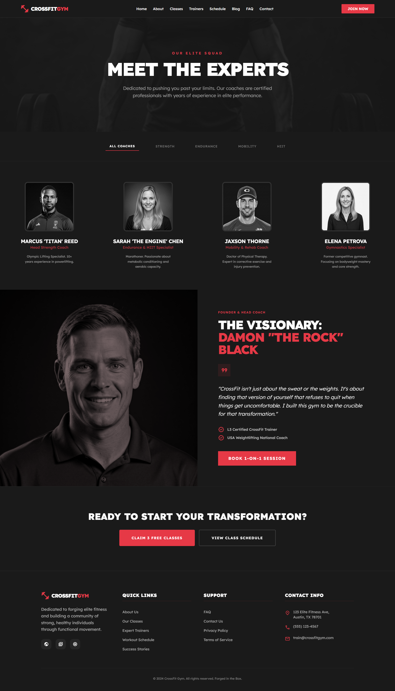

### Blog

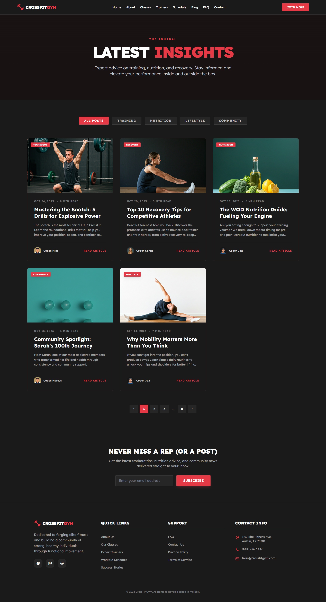

### Blog Details

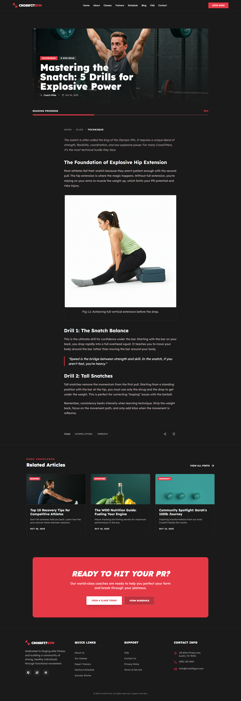

### Contact Us

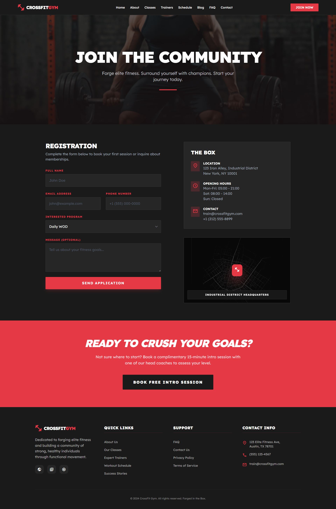

### FAQ

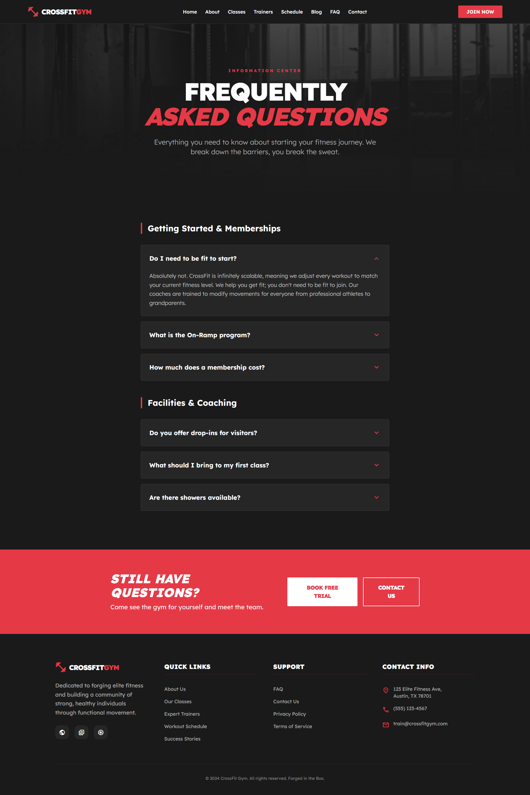

### Privacy Policy

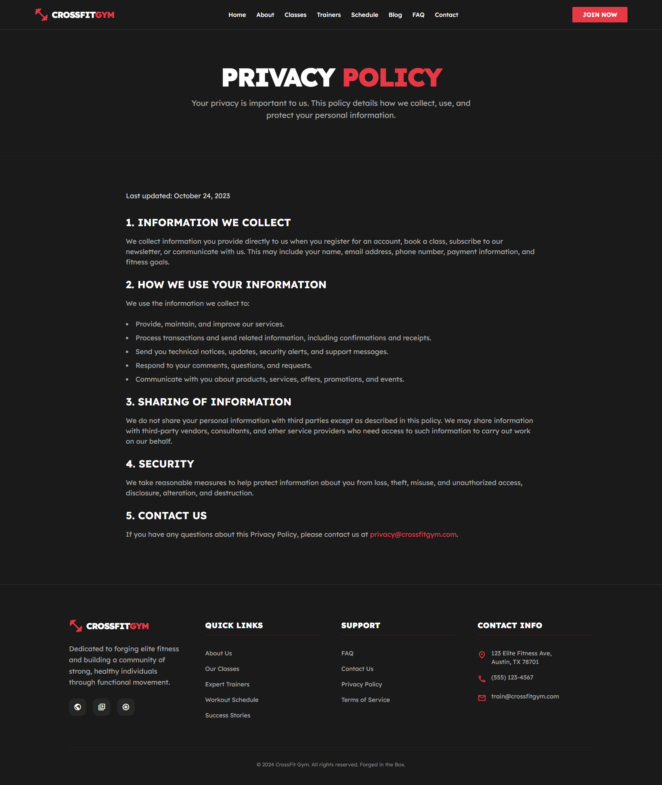

### Terms of Service

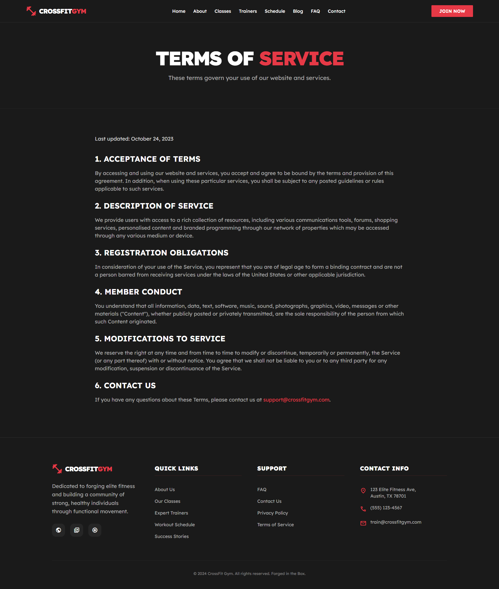

## Installation

Follow these steps to set up the project locally:

1.  **Clone the repository:**

    ```bash
    git clone <repository-url>
    cd crossfit-gym
    ```

2.  **Install PHP dependencies:**

    ```bash
    composer install
    ```

3.  **Install NPM dependencies:**

    ```bash
    npm install
    ```

4.  **Environment Setup:**
    Copy the `.env.example` file to `.env`:

    ```bash
    cp .env.example .env
    ```

    Update your database credentials in the `.env` file.

5.  **Generate Application Key:**

    ```bash
    php artisan key:generate
    ```

6.  **Run Migrations:**

    ```bash
    php artisan migrate
    ```

7.  **Run the application:**
    Start the local development server:

    ```bash
    php artisan serve
    ```

    Compile assets (if needed):

    ```bash
    npm run dev
    ```

    Visit `http://127.0.0.1:8000` in your browser.

## Tech Stack

- **Framework**: Laravel
- **Frontend**: Blade Templates, CSS/Tailwind (if applicable), JavaScript
- **Database**: MySQL (or as configured in .env)
